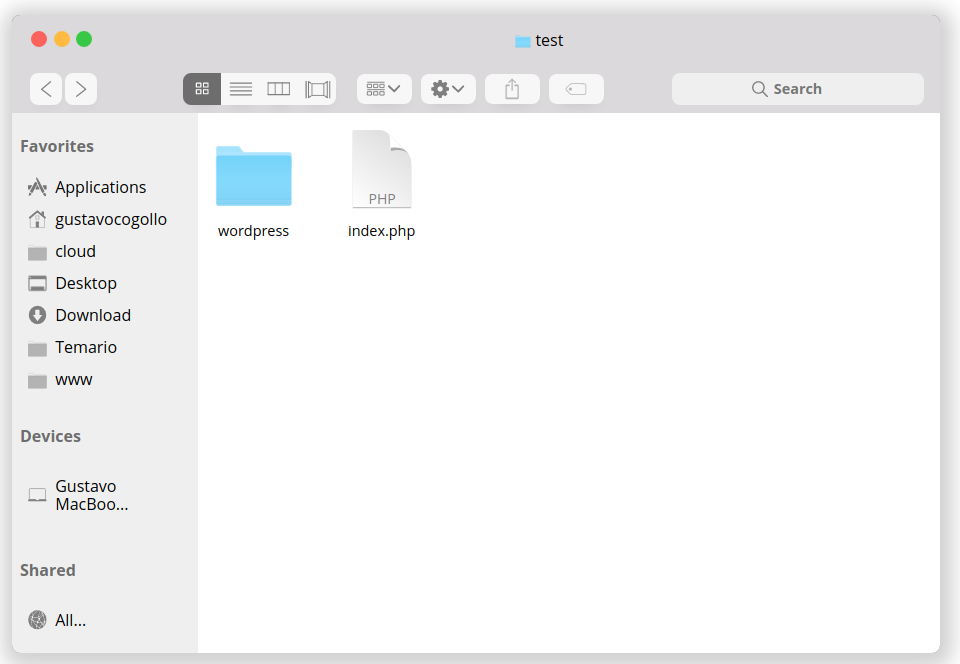

<!-- header -->
# Finder MacOs con CSS y HTML

Creacion de un finder al estilo macOs realizado solo con HTML y CSS (usando sass)

---

---

# [DEMO](https://gac982.github.io/finder_mac_css/index.html "demo")
